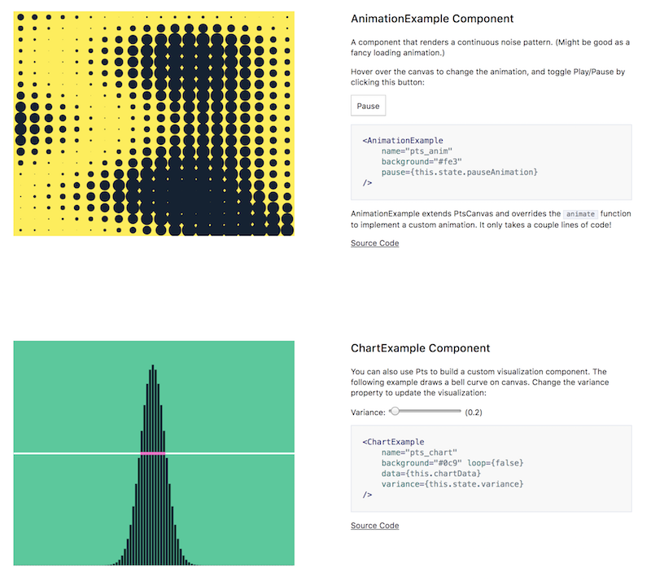

# pts-react-example

[Pts](https://github.com/williamngan/pts) is a typescript/javascript library for visualization and creative-coding. Get started at [ptsjs.org](https://ptsjs.org).

This project provides examples of using Pts in [React](https://github.com/facebook/react) components. This might be one of the simplest ways to make canvas animation in React.

1. Take a look at [the demo](https://williamngan.github.io/pts-react-example/build/).
2. Download or clone this repo and run `npm install`. Once installed, run `npm start` to test in localhost, and `npm run build` to make a build.
3. Quick start by extending the base [`PtsCanvas`](https://github.com/williamngan/pts-react-example/blob/master/src/PtsCanvas.jsx) to create your custom component. See components in [`PtsExamples`](https://github.com/williamngan/pts-react-example/blob/master/src/PtsExamples.jsx) that use this approach.
4. You can also use the [online demo editor](http://ptsjs.org/demo/edit/?name=polygon.convexHull) for quick experimentations.
5. Create your own React or other projects using Mozilla's [neutrino.js](https://neutrinojs.org). See below for details.


   

---

## Create your own build
This example is built with Mozilla's [neutrino.js](https://neutrinojs.org). Neutrino is a companion tool which combines webpack with good presets. It's fairly simple to customize your own project using it.

1. Install neutrino and a middleware such as `@neutrinojs/react`.
    ```bash
    npm install --save-dev neutrino @neutrinojs/react
    ```
2. Create a new project and customize your build.
    ```bash
    npx @neutrinojs/create-project <directory-name>
    ```
3. Finally install Pts and you are ready to go.
    ```bash
    npm install pts
    ```

Take a look at [the instructions](https://neutrinojs.org/installation/) on neutrino.js' website for details.

----

## Technical notes

Pts is an javascript es6 library that targets modern browsers. If you need to support older browsers, you may need to configure your build tools accordingly. Pts is currently in beta and may not be stable enough for production use.

If you want to customize your own build steps (instead of using neutrino.js), here are some pointers:

- UglifyJS doesn't seem to support extending built-in types unless the code is transformed to es5 first. You may consider other minify tool such as [uglify-es](https://github.com/mishoo/UglifyJS2/tree/harmony) or [babel-minify](https://github.com/babel/minify) (see a babel-minify example [in this repo](https://github.com/williamngan/pts-starter-kit)). The next major release of React should support [es6 builds](https://github.com/facebook/create-react-app/pull/3776).

- You may (or may not) need the [builtin-extend](https://github.com/loganfsmyth/babel-plugin-transform-builtin-extend) or [transform-classes](https://babeljs.io/docs/en/next/babel-plugin-transform-classes.html) plugins because Pts extends built-in types like Array and Float32Array. These may no longer be needed as build tools improve.

Javascript ecosystem is quite a moving target! If you're an expert in React and javascript build tools, please share your thoughts on best practices by posting in [Issues](https://github.com/williamngan/pts-react-example/issues). :pray: